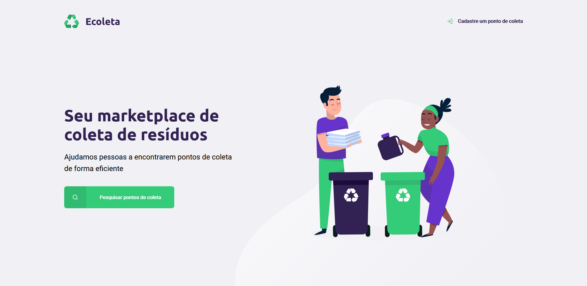
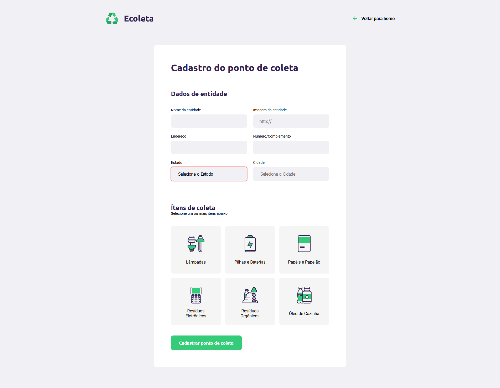
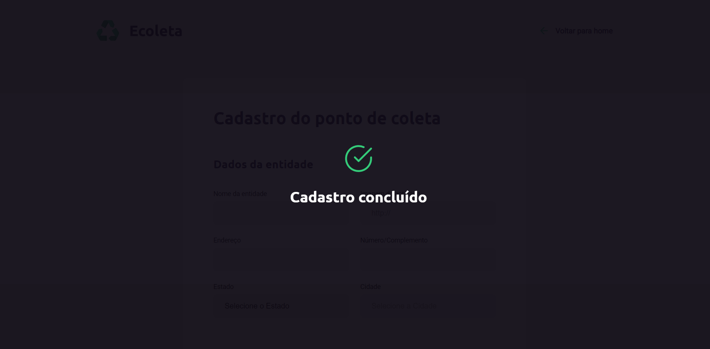
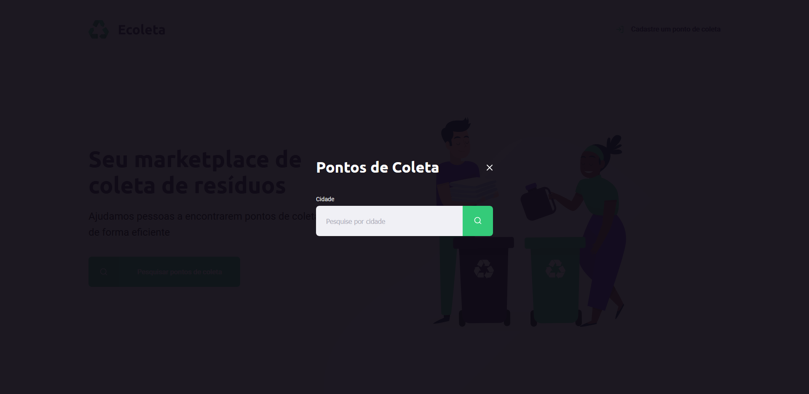
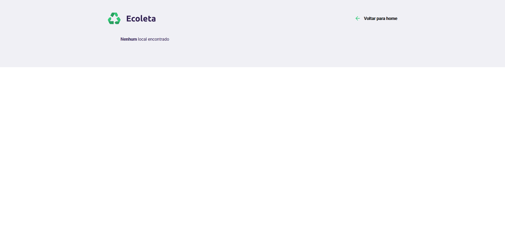

<h1 align="center">
 
  
 
 
Ecoleta Project
</h1>

NEXT-LEVEL-WEEK Add special garbage collection locations in certain cities

[//]: # (Add your gifs/images here:)
<h1 align="center">

  
  
  
  
  
  
  

</h1>

## Features

This website presents all the latest tools and practices in Web development!

- ✴️ **HTML** — For building the entire base of the web page
- 💠 **CSS** — To improve and modernize the web page layout
- ⚠️ **JavaScript** — For API integration and data creation
- 💹 **Node Js** — A web framework for back-end 
- 📄 **SQLite** — A open-source document database

## Description about Project

Repository dedicated to Rocketseat's Next Level Week activities

Next Level Week was a week of classes taught by Rocketseat, in which the students were able to learn a lot and start their journey in web development.

We had five days of intense coding with the aim of build an application that simulates a marketplace for waste collection. For this purpose, we learned about html, css and javascript for do the frontend, besides node.js and sql to construct the backend.

It was a great experience, mainly for who are starting at web development.